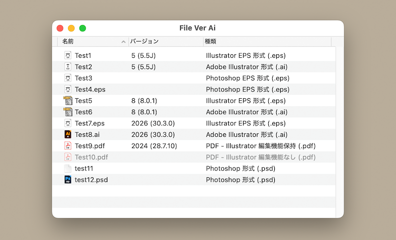

# File Ver Ai

- macOS用デスクトップアプリ
- Adobe Illustratorファイルの作成バージョンを表示
- EPSファイルの判別に対応
- Illustrator編集機能を保持したPDFファイルに対応

## 使い方

ウインドウにIllustratorファイルをドロップします。Dockのアプリアイコンにもドロップできます。

拡張子が一致しないファイルとIllustrator編集機能がないPDFはグレーアウトします。

## 動作環境

macOS 13.5 Ventura 以降（Universal Binary）

## ライセンス

This project is licensed under the MIT License - see the [LICENSE](LICENSE) file for details.
